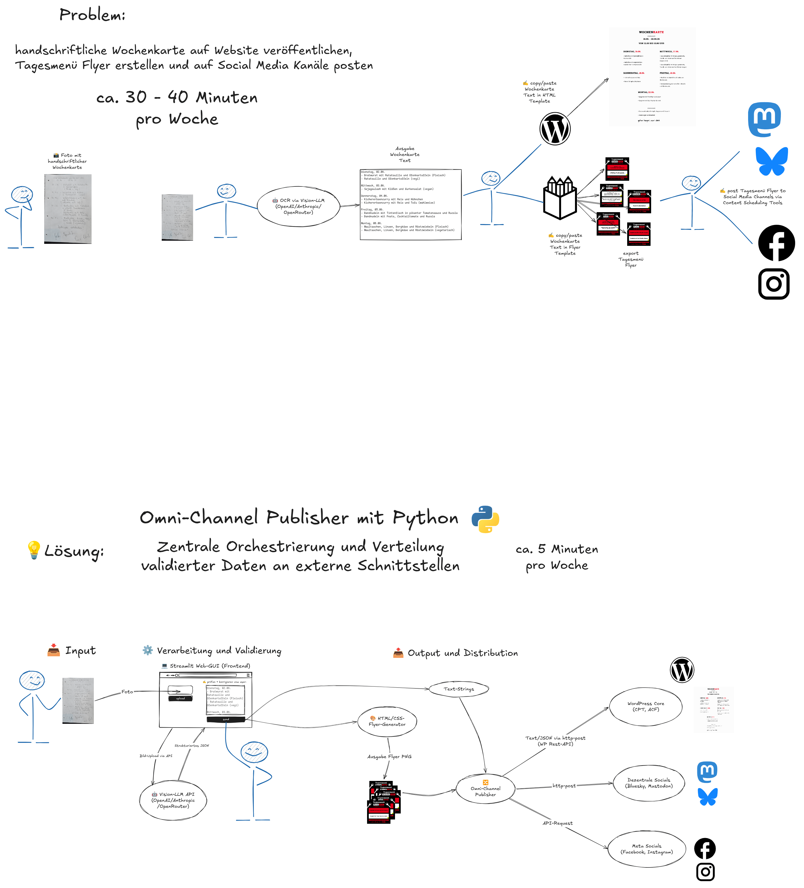

# Projektplan

**Projekt-Titel:** Entwicklung eines KI-gestützten Omnichannel-Marketing-Automations-Service für die Gastronomie (Wochenkarten-Tagesmenü-Manager)

👤 **Entwickler:** Jan Maaß

📅 **Projektzeitraum:** 22.06.2026 bis 08.07.2026

⏱️ **Geplante Gesamtarbeitszeit:** 50 Stunden

## 1. 🎯 Zielsetzung und Kurzbeschreibung

Das Ziel des Projekts ist die Entwicklung einer eigenständigen Python-Anwendung (Microservice), die den manuellen Workflow bei der Digitalisierung und Vermarktung von handschriftlichen gastronomischen Wochenkarten automatisiert.

Die Anwendung erfasst ein Foto der Speisekarte, wertet den Text mittels einer KI-Schnittstelle aus und stellt die Daten in einer Benutzeroberfläche zur manuellen Kontrolle und Korrektur bereit. Nach der Freigabe werden die Daten vollautomatisch an ein WordPress-CMS übertragen, parallel werden Flyer (PNG) der Tagesmenüs generiert und zu festgelegten Zeiten auf verschiedenen Social-Media-Kanälen (Bluesky, Mastodon, Facebook, Instagram) veröffentlicht.

 

## Systemarchitektur und Datenfluss Skizze

 

## 2. 🗂️ Phasenplanung und Zeitbudget

### **Phase 1**: Analyse und Konzeption (6 Stunden)

- **Aktivitäten:** Analyse der technischen Anforderungen der beteiligten Schnittstellen (APIs).
    
    - Festlegung des Datenmodells (Strukturierung der JSON-Daten für reguläre Tage, Tage mit nur einem Menü und Sonderfälle wie Feiertage oder Veranstaltungen).
        
    - Detailplanung des logischen Datenflusses basierend auf der Architektur-Skizze.
        
- **Meilenstein 1:** Das finale Daten- und Kommunikationsschema zwischen Benutzeroberfläche, KI und Zielplattformen ist definiert.

### **Phase 2**: KI-Anbindung und Datenvalidierung (12 Stunden)

- **Aktivitäten:**
    
    - Einrichtung der Entwicklungsumgebung und sicheren Verwaltung von Zugangsdaten (API-Schlüssel).
      
    - Einrichtung eines git Repositories für das Projekt.
        
    - Programmierung der Bildübergabe an die KI-Schnittstelle.
        
    - Implementierung der Logik für die strukturierte Datenausgabe (JSON).
        
    - Einbau von Fehlerbehebungs-Routinen (Exception Handling) für den Fall von Übertragungsfehlern oder unleserlichen Vorlagen.
        
- **Meilenstein 2:** Die KI liest handschriftliche Vorlagen so fehlerfrei wie möglich aus und übergibt sie als strukturierten Datensatz an das System.

 

### **Phase 3**: Entwicklung der Benutzeroberfläche (10 Stunden)

- **Aktivitäten:**
    
    - Erstellung der webbasierten Benutzeroberfläche mit Steuerungselementen für den Bild-Upload.
        
    - Integration des Daten-Editors (Eingabefelder für Menütexte und Datumsangaben) zur manuellen Qualitätskontrolle.
        
    - Implementierung der Datum- und Uhrzeit-Verarbeitung zur Standardisierung der Gültigkeit für die Folgesysteme.
        
- **Meilenstein 3:** Die grafische Oberfläche ist voll funktionsfähig, Daten können visualisiert, geprüft und manuell korrigiert werden.
    
### **Phase 4**: Medien-Generierung und Distribution (14 Stunden)

- **Aktivitäten:**
    
    - Erstellung der dynamischen HTML/CSS-Vorlage für den automatischen Grafik-Export des Tagesmenüs.
        
    - Einbindung der Rendering-Komponente zur Umwandlung des HTML-Designs in eine PNG-Bilddatei.
        
    - Anbindung der WordPress-REST-API zur Übertragung der reinen Textdaten in die vorgesehenen Datenfelder (Custom Fields).
        
    - Implementierung des Social-Media-Verteilers (Publisher) zur Bild- und Textübertragung an Bluesky, Mastodon und die Meta-Schnittstelle.
        
- **Meilenstein 4:** Nach der Freigabe in der Oberfläche werden die Daten fehlerfrei an die Website übermittelt und die Bilddateien auf allen Social-Media-Kanälen gepostet.
    

### **Phase 5**: Qualitätssicherung, Testphase und Dokumentation (8 Stunden)

- **Aktivitäten:**
    
    - Durchführung von Integrationstests mit verschiedenen Wochenkarten-Fotos und Edge-Cases (z.B. Feiertage ohne Menü).
        
    - Optimierung des Codes und der Fehlerbehandlung bei Netzwerkunterbrechungen.
        
    - Erstellung der Projektdokumentation und Vorbereitung der Präsentation.
        
- **Meilenstein 5:** Das Projekt ist erfolgreich getestet, bereit zur Abnahme und die Dokumentation liegt vollständig vor.
    
## 3. ⚡ Ressourcen- und Risikomanagement

> [!DANGER] > 
> - **Risiko 1: Schnittstellen-Änderungen oder restriktive API-Zugänge (insb. Meta/Facebook)**
>     
>  - _Gegenmaßnahme:_ Nutzung des Meta Graph API Explorers zur Erzeugung temporärer Entwickler-Tokens, um langwierige Verifizierungsprozesse zu umgehen.

> [!DANGER] >   
>         
> - **Risiko 2: Abweichungen im Zeitplan durch unerwartete Programmierfehler**
>     
>  - _Gegenmaßnahme:_ Verwendung etablierter, stabiler Python-Bibliotheken für die GUI (Streamlit) und das Bild-Rendering, um den Eigenbau-Aufwand für die UI-Logik auf ein Minimum zu reduzieren. Das integrierte Zeitpolster in Phase 5 fängt eventuelle Verzögerungen ab.
